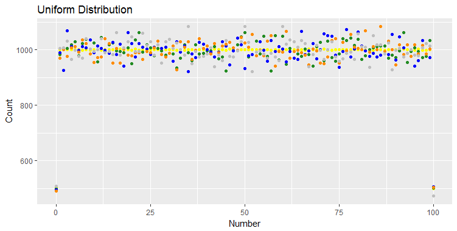
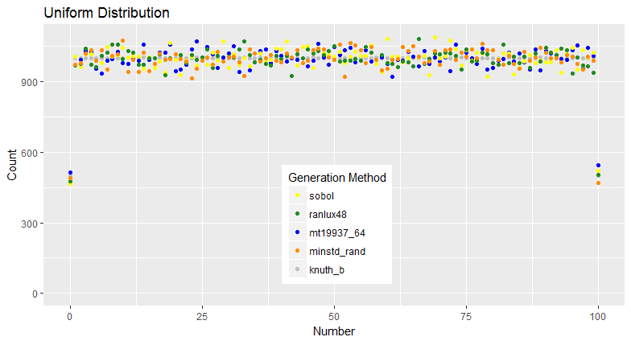
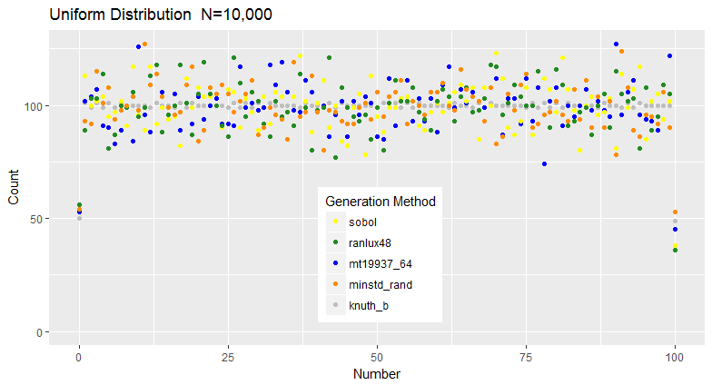
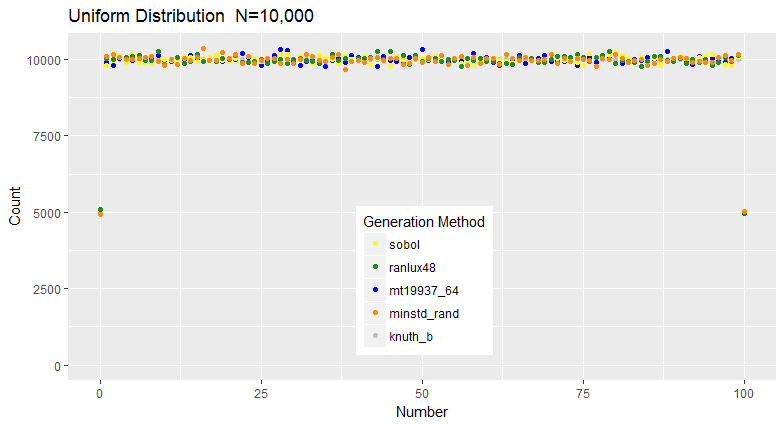
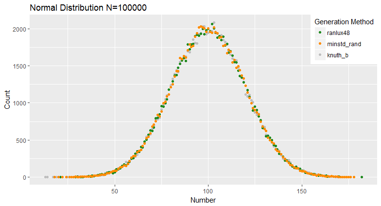
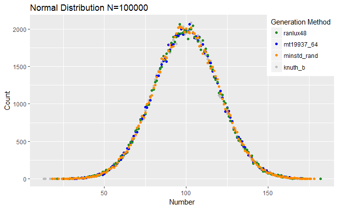
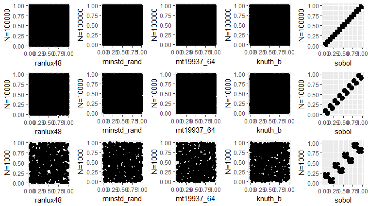
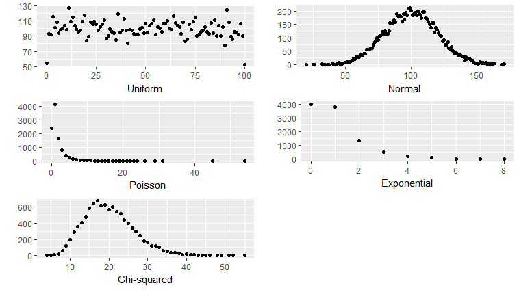
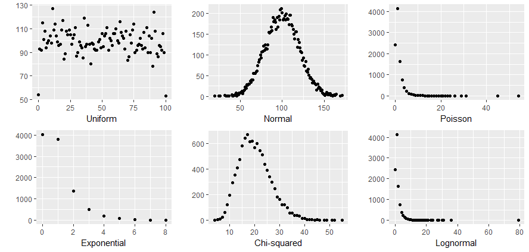
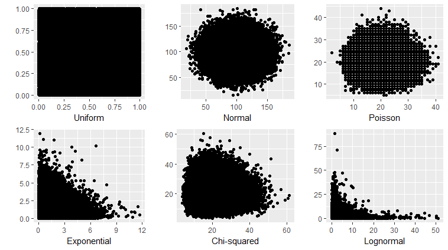

3/17/17
Starting a markdown file to track what I am doing on homework 2.
Created 5 files
4 using Random 
1 using QuasiRandom-Sobol
file names:
	results_knuth_b-uniformN100000.txt
    results_minstd_rand-uniformN100000.txt
    results_mt19937_64-uniformN100000.txt
    results_ranlux48-uniformN100000.txt
    results_sobol-uniformN100000.txt

I pulled the results from two into R and managed to plot them using ggplot earlier in the week.  I am going to try to repeat that feat.

Okay the two end points have about half as many entries as the other values and there are 101 entries rather than 100.  I looked in the code, but I could not find a way to easily combine the values for the two end points.  There may be somewhere that > needs to be >= or < needs to be <= but I have not found it.

Therefore, I am taking the values of the two end points and summing them in R storing the result in the first end point and deleting the last end point.  The resulting graphs should not have the same outliers.

I am then looking at how to do a comparison with the uniform distribution.  How do I know that the uniform distribution in R is any more uniform than any of these?  Of course, a purely uniform distribution of 100 numbers in 100,000 picks would be 1,000 of each number.  I shoud be able to create that as a matrix and do a comparison.

Well, I created that matrix, but I am still not sure about doing the comparison.
3/20/17
Generated results and set up new directory structure for output files to keep them organized.  Created an Output directory.  Under the Output directory thre are separate directorys for each type of distribution.  Within each type of distribution the file names indicate the random number tool used to generate the random numbers and the size of N used for the run.
3/25/17
The end points have about half as many entries as the other values because the random numbers are generated on an interval between 0 and 1.  They are then scaled to integers for the interval from 0 to 100.  For all integer values inside the interval the real numbers below and above the integer will round to the integer.  For example, values from 0.50000 to 1.49999 will round to 1.  However, there are no values below 0 so only values from 0.00001 to 0.49999 round to 0, about half as many as would round to any interior digit.  The same is true at the other end of the scale.  There are no values above 100 so only values from 99.50000 to 100.00000 will round to 100.  This means the end points have about half as many entries as any of the interior values.  This is clearly seen in the image 
Make the image better - 
	1. Scale the Y axis from 0 so the beginning and ending points are at about half way.  
	2. Add a legend showing which color is from which random number generator.
	3. Change the title to reflect this is a count of times a number appears.

Well that took a lot longer to figure out than I thought it would.  Did it using the following R code:```
library(ggplot2)
# Read data from files
jak1 <- read.table("results_knuth_b-uniformN100000.txt", header = FALSE)
jak2 <- read.table("results_minstd_rand-uniformN100000.txt")
jak3 <- read.table("results_mt19937_64-uniformN100000.txt", header = FALSE)
jak4 <- read.table("results_ranlux48-uniformN100000.txt", header = FALSE)  
jak5 <- read.table("histogram_sobol-resultsN100000.txt", header=FALSE)
# Plot data with different colors
ggplot(jak5, aes(ymin=0)) + labs(x="Number", y="Count",title="Uniform Distribution") +
  geom_point(aes(x=jak5$V1, y=jak5$V2, colour = "yellow")) +
  geom_point(aes(x=jak4$V1, y=jak4$V2, colour = "forestgreen")) +
  geom_point(aes(x=jak3$V1, y=jak3$V2, colour = "blue")) +
  geom_point(aes(x=jak2$V1, y=jak2$V2, colour="darkorange")) + 
  geom_point(aes(x=jak1$V1,y=jak1$V2, colour="grey")) +
scale_color_manual(name="Generation Method", 
                   labels=c("sobol","ranlux48","mt19937_64","minstd_rand","knuth_b"), 
                   values=c("yellow","forestgreen","blue","darkorange","grey")) +
  theme(legend.position = c(.6,.5),legend.justification = c(1,1))
```
With the number of values generated equal to 100,000 and the values ranging from 0 to 100, the expectation is that each value would appear about 1,000 times.  Based on the results in the following image  these methods generally meet that expectation.
If is smaller, say N=10000, the distribution spreads a little more, but the graph still appears uniform as shown below 
On the other hand if N becomes larger, for example N=1,000,000, then the distribution appears even closer to uniform.  This is shown in the tight grouping of the graph below.

To more accurately compare the differences from the values of N, apply a chi-squared test to the raw data as opposed to the count of each number as shown on the graphs above.  For the Uniform Distribution across these three values of N, chi-squared results are shown below.
> > chisq.unif.test(knuth1[,1],interval=c(0,100))

	Discrete uniform(0,100) chi-squared test

data:  knuth1[, 1]
X-squared = 17.116, df = 19, a = 0, b = 100, p-value = 0.582

> chisq.unif.test(knuth2[,1],interval=c(0,100))

	Discrete uniform(0,100) chi-squared test

data:  knuth2[, 1]
X-squared = 27.359, df = 19, a = 0, b = 100, p-value = 0.09657

> chisq.unif.test(knuth3[,1],interval=c(0,100))

	Discrete uniform(0,100) chi-squared test

data:  knuth3[, 1]
X-squared = 15.952, df = 19, a = 0, b = 100, p-value = 0.6605

> chisq.unif.test(knuth1[,1],interval=c(1,99))

	Discrete uniform(1,99) chi-squared test

data:  knuth1[, 1]
X-squared = 42.912, df = 19, a = 1, b = 99, p-value = 0.001333

> chisq.unif.test(knuth2[,1],interval=c(1,99))

	Discrete uniform(1,99) chi-squared test

data:  knuth2[, 1]
X-squared = 348.48, df = 19, a = 1, b = 99, p-value < 2.2e-16

> chisq.unif.test(knuth3[,1],interval=c(1,99))

	Discrete uniform(1,99) chi-squared test

data:  knuth3[, 1]
X-squared = 3855.2, df = 19, a = 1, b = 99, p-value < 2.2e-16
As shown, when the end points are included the generated distribution deviates from the uniform distribution when compared using a chi-squared test.  However, if the end points are omitted and the sampled data is compared from 1 to 99 then the chi-squared test shows the good fit with the uniform distribution which was expected.
3/26/17
Struggled to get the normal distribution all on one plot because the data frames are of different sizes.  This happens because some values of x are not represented in some of the output files.  With a normal distribution this makes sense as values at the far ends of the curve are less likely to be present.  Did not hit this with the uniform distribution because all values of x appeared at least some of the time.
Unfortunately, I only seem to have normal distribution files for 3 of the 5 distributions and one of those only for one value of N.  While I would like to keep plotting, I think I need to go generate the missing data files and finish the normal distribution before moving to other plots.  Here is the normal distribution so far 
Generating the mt19937_64 for the three different sizes of N was not so difficult.  Here is the resulting plot.  I have no idea how to do a normal distribution with the sobol generator.  It seems to be designed to return a uniform distribution.
Okay, wait I am making this more difficult than it needs to be.  The assignment says to pick one random engine and vary five different distributions.  I've already generated files for more than five distributions and for most of the engines.  I should just move to graphing those.  Plus I have a graph showing how things vary for the normal distribution for different values of N.  I need to get that into a readme. If I did not feel pressed for time I would redo this chart to add more color.    What would be really interesting to me is to redo it with smaller values of N.  How does this look for N=200, N=500 then N=1000 and N=2000.  After 10000 values the chart just becomes too dense to be meaningful.  Unfortunately, the remainder of the assignment needs attention.
Back to step 3 getting multiple distributions on one chart.  I think  I culd do that with grid arrange as I did this one.  I just need to create the individual plots.
So, create individual plots for uniform, normal, exponential, Chi-squared and Poisson because I have data generated for those distributions. Okay, I generated data using the knuth_b engine.  I plotted it for N=10,000 and the results are shown in the following figure.  If I find time I should go add lognormal.  I did it - added lognormal new figure is 
Now I need to take the different distributions and plot them on the unit square.  I am not sure if I generated data for that or not.  Okay, I had to regenerate data.  I did it for N=100,000 and if I have time I will do it again for N=1,000 because the plots are very dense.  I actually did six distributions so it would fit nicely in two rows and three columns.  The graphs are   
So now I just need to do that again for the unit circle.  That may need to wait till tomorrow.  Time to look at snakes and ladders.

