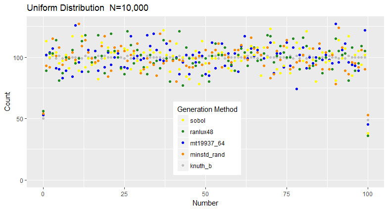

#Homework 2 :  Discrete-Event Simulation Assignment

## IDS6938-Simulation Techniques - [University of Central Florida](http://www.ist.ucf.edu/grad/)

[University of Central Florida](http://www.ist.ucf.edu/grad/)
Julie A Kent

The assignment is due: **Tuesday, March 28 at 11:59PM (EST)**

I will be taking 1 late day and turning this in on Wednesday, March 29th.  I will have two late days to use on the final project.

# Introduction
A Discrete-event Model simulates a complex system as an ordered sequence of well-defined events. Mathematically Discrete-event models use Markov Processes, Queuing systems, events, probability / statistics, and random variables. The purpose of this assignment is to learn the mathematical foundations, how to program these models, and how to simulate them. The assignment is due Tuesday, March 28, 2017 at 11:59 P.M.

The goal of this assignment is to become familiar with the concepts in the second third of the class. You will be expected to compose a *final report* which demonstrates your understanding on the material in each section of the assignment. Be visual! - Pictures say a thousand words so you do not have to. Show off your different configurations and really explore the assignment.

# Assignment
##Part 0 - Getting Started

Files and results are in both the Homework 2 folder and in Discrete 2.

##Part 1: Empirical Tests of Randomness (20 pts).
We looked at different ways to generate [pseudo-random numbers](https://en.wikipedia.org/wiki/Pseudorandom_number_generator) and [quasi random numbers](https://en.wikipedia.org/wiki/Low-discrepancy_sequence). Generating random numbers are crucial to Discrete-Event simulations which rely on random variables and stochastic processes. This problem explores different random number generators, distributions, and statistics. Different [C++ pseudo-random numbers engines are instantiated](http://www.cplusplus.com/reference/random/) already for you. Also a a wide variety of standard distributions are implemented. Two quasi random number generators are also provided.
* **(a) - 3pts:** Output the results of five different random number engines, using a uniform distribution for values between [0-100]. 
Generated results for 5 different engeines: knuth_b, minstd_rand, mt19937_64, ranlux48 and sobol.  A chart showing the results is given.

The end points have about half as many entries as the other values because the random numbers are generated on an interval between 0 and 1.  They are then scaled to integers for the interval from 0 to 100.  For all integer values inside the interval the real numbers below and above the integer will round to the integer.  For example, values from 0.50000 to 1.49999 will round to 1.  However, there are no values below 0 so only values from 0.00001 to 0.49999 round to 0, about half as many as would round to any interior digit.  The same is true at the other end of the scale.  There are no values above 100 so only values from 99.50000 to 100.00000 will round to 100.  This means the end points have about half as many entries as any of the interior values.  This is more obvious in the improved image below. 
With the number of values generated equal to 100,000 and the values ranging from 0 to 100, the expectation is that each value would appear about 1,000 times. these methods generally meet that expectation.
* **(b) - 2pts:**  Vary *N* (amount of samples). How do things change.
If the number of samples is smaller, say N=10000, the distribution spreads a little more, but the graph still appears uniform as shown below 
On the other hand if N becomes larger, for example N=1,000,000, then the distribution appears even closer to uniform.  This is shown in the tight grouping of the graph below.

To more accurately compare the differences from the values of N, apply a chi-squared test to the raw data as opposed to the count of each number as shown on the graphs above.  For the Uniform Distribution across these three values of N, chi-squared results are shown below.
> > chisq.unif.test(knuth1[,1],interval=c(0,100))

	Discrete uniform(0,100) chi-squared test

data:  knuth1[, 1]
X-squared = 17.116, df = 19, a = 0, b = 100, p-value = 0.582

> chisq.unif.test(knuth2[,1],interval=c(0,100))

	Discrete uniform(0,100) chi-squared test

data:  knuth2[, 1]
X-squared = 27.359, df = 19, a = 0, b = 100, p-value = 0.09657

> chisq.unif.test(knuth3[,1],interval=c(0,100))

	Discrete uniform(0,100) chi-squared test

data:  knuth3[, 1]
X-squared = 15.952, df = 19, a = 0, b = 100, p-value = 0.6605

> chisq.unif.test(knuth1[,1],interval=c(1,99))

	Discrete uniform(1,99) chi-squared test

data:  knuth1[, 1]
X-squared = 42.912, df = 19, a = 1, b = 99, p-value = 0.001333

> chisq.unif.test(knuth2[,1],interval=c(1,99))

	Discrete uniform(1,99) chi-squared test

data:  knuth2[, 1]
X-squared = 348.48, df = 19, a = 1, b = 99, p-value < 2.2e-16

> chisq.unif.test(knuth3[,1],interval=c(1,99))

	Discrete uniform(1,99) chi-squared test

data:  knuth3[, 1]
X-squared = 3855.2, df = 19, a = 1, b = 99, p-value < 2.2e-16
As shown, when the end points are included the generated distribution deviates from the uniform distribution when compared using a chi-squared test.  However, if the end points are omitted and the sampled data is compared from 1 to 99 then the chi-squared test shows the good fit with the uniform distribution which was expected.

* **(c) - 3pts:** Fix a random engine of your choice from part (a), and now vary five different [distributions](http://www.cplusplus.com/reference/random/) for just the psedo-random numbers. Again, analyze your results with graphs and statistics of choice.
First the Normal distribution.

Then the Poisson distribution (used for arrivals in M/M/1 queues )

Next use Lognormal distribution

Followed by the Exponential distribution (used in Part 3 for the airport queues).  This graph was challenging because all the points were so close together I had to adjust the sizes so they could all be seen.

Finally the Chi-Squared distribution so I can see what it looks like.

* **(d)- 4pts:** Generate random numbers in two-dimensions for a unit square. Plot the results for the different random number engines. The vertical axis should vary N in increasing order. The horizontal axis should show of the random number engines.
This is shown below on one diagram.  I have tried unsucessfully to implement the multidimensional version of sobol.  Currently, even using different seeds the results are correlated resulting in a graph that appears like footprints.

* **(e)- 4pts:** Generate random numbers in two-dimensions for a unit square. Plot the results for the different distributions. The vertical axis should vary N in increasing order. The horizontal axis should show of the random number engines. 
So I did not see the recommended values for N until after I had generated these graphs.  I think the different distributions is very interesting.

* **(f)- 4pts:** Repeat parts (d) and (e) with a unit circle.
Repeating with Unit Circle

Since these are raw results, to look at a smaller set of data, I can just truncate the data in R.  That gives a more interesting graphic and I can feel my computer breathing a sigh of relief at having less data in memory. 

Last but not least is the unit circles with the different distributions. 

## Part 2 - Snakes and Ladders (Discrete Event Markov Chains and Monte Carlo Simulations) (30 pts)

We all love board games. A board game can be viewed mathematically as a Markov chain, where the probability of moving to the next position depends only on the position you are currently at and the chances provided by tossing a dice. For this part of the homework we will simulate the game "*Snakes and Ladders*" (This goes by other names: Chutes and Ladders, Moksha Patam but all essentially the same gameplay.)

| Moksha Patam  | Snakes and Ladders |
| ------------- | ------------- |
|   |  |

##### Background
The classic game has 100 positions on the board. You toss one die, and move squares based on the result of the die. If you land on a ladder you move up the ladder to a higher numbered square. If you land on a snake's mouth, you descend to a lower numbered square. For purposes of simulation, we will add one extra square 0 (starting position). So there are 101 positions on the board.

The game is **memoryless** - your progression to the next position is independent of how you arrived there (opposed to Blackjack or Candyland where your progression is based on what cards have been drawn). A Markov Chain defines the probability of a move from state *i* to state *j* by a **Transition Matrix**, *T*. So in the case of *Snakes and Ladders* the dimensions of a transition matrix is 101x101.

Thankfully the Eigen website [https://eigen.tuxfamily.org/dox/group__TutorialMatrixArithmetic.html](https://eigen.tuxfamily.org/dox/group__TutorialMatrixArithmetic.html) had a good explaination of multiplying Eigen vectors and Eigen matrices.  

Also many thanks to [http://www.ilanman.io/the-data-game/2015/9/26/markovchain](http://www.ilanman.io/the-data-game/2015/9/26/markovchain) for a wonderful explaination of what is going on with the Markov chains.  He even included a link to Python source code.
* **(a) Null State Game transition matrix - 10pts:** The *null state game* is defined by a game with no snakes and no ladders. 

* **(b) Simulate and analyze the results of Null State Game - 10pts:** What is the modal number of moves required by a single player to finish the game? We will be simulating the game two different ways. **(1) Markov Chain**: The game can be analyzed with a row vector, *v* with 101 components, representing the probabilities that the player is on each of the positions. V(0) is (1,0,0,...,0) since we know we start at square 0. v evolves by:   
For this part (1) use the *Markov project* in the Snake and Ladders starter code. 

Ran the null game initially with a 12x12 matrix and then with a full board.  For the Markov Chain the probabilities make an interesting heatmap.  
  The minimatrix was easier to see so I'll include it here just for reference   So the disbursement of the yellow indicating likely landing places is a more obvious pattern in the larger matrix, but it is clearly present even in the minimatrix.  It is interesting how it fades as the first possibility of winning appears.

**(2) Monte Carlo**: Use a monte carlo process to solve our Discrete Time Markov Chains. Here (2) use the DTMC project, and utilize the DTMC method similar to what we did in class.  

I added error checking using the absolute value of the difference between the sum of the probabilities for the row and 1 because the floating point numbers do not total exactly to one.  I checked for the difference being larger than 0.0000001.  Then I ran the null matrix using DTMC.  I saved all the resulting vectors to a file along with the number of rolls required to reach 100.  Creating a histogram for the number of rolls to reach 100 gives 
 
I created a heatmap for the Monte Carlos results with a null matrix. As the player moves along the board the color changes from green to yellow to orange and then fades once the game is won. 
* **(c) Simulate and analyze the results of Snakes and Ladders -10pts:**  
Initially I just added ladders. The ladders only game requires fewer rolls to win.  The histogram for ladders only shifts to the left compared to the null game.  Adding Snakes should shift it back to the right as shown by the actual results in the histogram. 
Adding snakes to the ladders provides a wider range on the number of rols to win including a number of games that had not finished in 100 rolls.  For completeness, there is also a view of rolls to win for Snakes only.  In this case clearly many games did not finish after 100 rolls.  The heatmap of the Snakes Only game looks like 

The Markov Analysis for the Snakes only game gives the following heatmap   This is a much wider dispursion than the Ladders only game shown below. Finally the Snakes and Ladders heatmap is   The green verticals in each of these diagrams represents the start of a snake or the start of a ladder as these are spaces where players will not land at the end of a turn.

* **(d) Think - 0pts:** Games are a structured form of play.  Therefore, Snakes and Ladders can easily be considered game.  It has structure and generally at least one player enjoys it even if that player is not the parent.  Games do not necessarily need to involve skill or intelligence.

##Part 3 - Discrete Event Simulation - Queue Simulation (30 pts)

This problem will look at queues and commonly used performance measures. For this problem we will look to design a simple airport security check. We will make the following assumptions: (1) there is only one airline - Southwest; (2) passengers' interarrival times are independent and identically distributed (IID) with an exponential distribution with mean 1 / lambda. The service times are also assumed to be IID and exponentially distributed random variables with mean 1 / mu.
  
When a passanger arrives they have to wait in a queue to present their ID and ticket to the gate agent with all the other passengers. Once approved by the agent they will have to pass through a security check. Since this is Orlando, there are only 3 open metal/screening devices open and again passangers have to wait in a queue. After passing through security you again have to wait in a queue to board your plane.

* **(a) - 4pts:** To start create the senario in the figure above in *main.cpp*. Checkin will have a *mu* of 53 and accept new arrivals, the security gates will have a *mu* of 20, and will not accept new arrivials, boarding will have a *mu* of 80. You will have to set up  the appropriate *MM1_Queue* objects to capture the functionality above.
* **(b) - 4pts:** You want to add a check that your process is within an error range *is_within_error_range(float)* where the error range will be 0.002. You also want to process the next event, and add an external arrival where marked.
* **(c) - 3pts:** in *mm1_queue.cpp* : add code to caculate the expected results for:

 Metric | Checkin | TSA1 | TS2 | TSA3 | Boarding |
--------|--------|--------|--------|--------|--------|
 expected_server_utilization | 0.622642 | 0.55 | 0.55 |  0.55 | 0.4125
 expected idle prob       | 0.377358    | 0.45 | 0.45 |  0.45 | 0.5875
 expected queue length       | 1.02736  |0.672222 |0.672222 |0.672222|0.289628
 expected number customers     | 1.65   |1.22222 |1.22222| 1.22222 | 0.702128
 expected waiting time | 0.0311321 | 0.0611111 |0.0611111 | 0.0611111 |0.0087766
 expected response time       | 0.05     | 0.111111 |0.111111| 0.111111 | 0.0212766

*  **(d) - 4pts:** Write code to call the functions to output and generate data from the airport senario. 
I generated files for wait and service times for each queue.  I created histograms for the TSA queues on one chart so they are easy to compare.
 Notice that all of the queues have approximately the same behavior.  The checkin and board queues shown below have histograms of a somewhat different shape.  Note the difference in scale on the charts. 

* **(e) - 15pts:** Download the personal edition of **[Anylogic](http://www.anylogic.com/)**, read through the [documentation](http://www.anylogic.com/learn-simulation) as needed, and set up the same type of simulation discussed above.
The model file is Air2.alp and it is in Homework2/queues/output.  I will try including a link .  I also exported a PDF with the documentation generated by AnyLogic.   The problem gave an interarrival rate for new passengers so I used a Poisson distribution to generate travelers because that is consistent with an M/M/1 queue.

Finally, here is a screenshot of the running model.

##Part 4 - Implementing Extra Features (10 pts)

I have implemented a 2D visualization in AnyLogic.  In the two D model the airport screeners turn red when they are in use and turn green when they are available. 
* **(10 Points)** - Add a 2D visualization to AnyLogic for Part 3.
I did not implement a holding area in my 2D model.  Individuals in the model move directly from queue to queue.  Based on my airport experience, this is realistic at the check in and TSA lines.  Unfortunately, it is becoming more common for boarding as well.

##Part 5 - Final Report (10 pts)
Write up the results to the previous sections in the main *readme.md* in your forked repository. Turn in the URL for your fork in webcourses. Be visual. The report should contain the graphs and analysis requested. I have high expectations for the documentation here and you should allot the proper time to compose the writeup.

##Extra Features (Extra Credit - 25pts)
You have to implement two features from this list for Part 4. You may choose any two features you wish from this list. (Please explicitly note them in your *Readme.md*)

* **(10 Points)** - Provide code in (Python, R, Matlab...) that demonstrates an animation of the board itself evolving overtime for Snakes in Ladder for part 2. 
I wanted to try to automate this, but I have run out of time.  I did provide the heatmaps.   There are several additional heatmaps and the R code to generate them.

* **(10 Points)** - Add a 2D visualization to AnyLogic for Part 3.
Implemented for Part 4 above.   Additional picture shown here. 
* **(10 Points)** - Add a 3D visualization to AnyLogic for Part 3.
I also did a 3D model in AnyLogic.  Below are two pictures of the 3D model.

* **(5 Points)** - Pick a research problem (from your dissertation, Energy Microgrids, Missle Defence...). Compare and contrast different software packages (AnyLogic, Simio, Simulu8, Arena etc). Convince me as your "manager/advisor" what advantages, weaknesses, and costs each program has. Come to a conclusion. 
* Roughly sketch out how you would formulate the problem in the framework.
I have a Word document with a writeup describing a choice of product for another project I am working.

