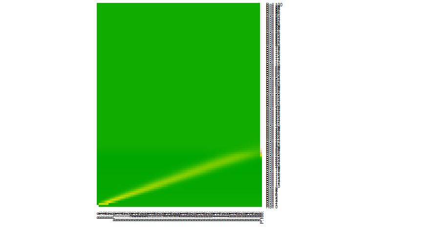
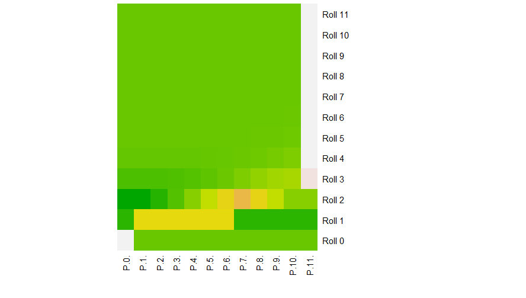

Creating ongoing entries about Part 1 worked so well, I think I will jot down what I am trying with Snakes and Ladders.  I can possibly also pull in some of the references I have been using.

What is working
1. DTMC is working with a null transition matrix

What is not working
A. Markov chain will not link.  The error is 
2>C:\Users\jaken\OneDrive\Documents\Spring 2017 SimTech\IDS6938-SimulationTechniques\Homework2\SnakesAndLadders\rebuild\Debug\Markov.exe : fatal error LNK1120: 1 unresolved externals

What I need to add
1. Add error checking on the transition matrix (sum to 1) (done)
2. Add ladders
3. Add chutes (these seem to be the same essentially as ladders)

Things I have tried to fix the link issue:
1. Downloading the entire class structure agasin in a separate directory and rebuilding the project there.
2. Downloading Lecture 9 recrusively.
3. Using cmake with the build at Visual Studio 14 2015 Win 64
4. Using cmake with the build at Visual Studio 14 2015
5. Going to Lecture 9 and rerunning cmake and then building all the projects
6. Googling the error code
7. I added markov.cpp as a source file in the Markov project and it seems to have worked.  I don't think I deleted it and I would have thought one of the many downloads would have included it.  I have no idea why I would need it and everyone else would not except perhaps a directory setting unique to my installation of Visual Studio.  Perhaps, I can now try to make sense of this part of the project.

Before I try to add ladders, I want to determine what we are trying to do with the discreteMC.  

If I have time I will go back and plot the results of the files generated in the queue portion of this assignment.

Okay, I think I have something on the Markov chain.  If I start with the vector of (1,0,0...) one followed by all zeros and I transpose it, I can then multiply it by the TransitionMatrix to get another vector.

Thankfully the Eigen website [https://eigen.tuxfamily.org/dox/group__TutorialMatrixArithmetic.html](https://eigen.tuxfamily.org/dox/group__TutorialMatrixArithmetic.html) had a good explaination of multiplying Eigen vectors and Eigen matrices.  

Also many thanks to [http://www.ilanman.io/the-data-game/2015/9/26/markovchain](http://www.ilanman.io/the-data-game/2015/9/26/markovchain) for a wonderful explaination of what is going on with the Markov chains.  He even included a link to Python source code.

So I started with a 12x12 matrix so I had room to work, but not so much to track.  I have hard coded the vector multiplication for 12 itterations so clearly I need to go back and put this in a loop so I can run it for a larger matrix.  However, I'm trying to figure out what I should put in the output file.  I am displaying the transposed matrix so it shows up as a single row on the screen.  I think it might be nicer to save as comma separated values, but I am not sure.  I need to produce graphs to analyze the results and show how the game evolves over time.
Alright for my tiny game with a 12x12 matrix, I have a comma separated output file.  I think I have even coded this so changing size will work for the full size game.  Now, what can I do with these results in R?
I can create a heatmap.  Need to loose the trailing comma and consider adding headers and row names. Well, did that, but now it needs more munging in R.  Okay, should I try it now for a big game?  Why not?  Do that then go to sleep and think about adding snakes and ladders.  Here is the heatmap   The minimatrix was easier to see so I'll include it here just for reference   So the disbursement of the yellow indicating likely landing places is a more obvious pattern in the larger matrix, but it is clearly present even in the minimatrix.  It is interesting how it fades as the first possibility of winning appears.
Okay, tomorrow I add snakes and ladders and then repeat this for the DTMC part.
Well, first I added error checking using the absolute value of the difference between the sum of the probabilities for the row and 1 because the floating point numbers do not total exactly to one.  I checked for the difference being larger than 0.0000001.  Then I ran the null matrix using DTMC.  I saved all the resulting vectors to a file along with the number of rolls required to reach 100.  Creating a histogram for the number of rolls to reach 100 gives 
Then I added ladders.  The ladders only game requires fewer rolls to win.  The histogram for ladders only shifts to the left compared to the null game.  Adding Snakes should shift it back to the right. 
Adding snakes to the ladders provides a wider range on the number of rols to win including a number of games that had not finished in 100 rolls.  For completeness, there is also a view of rolls to win for Snakes only.  In this case clearly many games did not finish after 100 rolls.
The Markov Analysis for the Snakes only game gives the following heatmap   This is a much wider dispursion than the Ladders only game shown below. Finally the Snakes and Ladders heatmap is   The green verticals in each of these diagrams represents the start of a snake or the start of a ladder as these are spaces where players will not land at the end of a turn.
Games are a structured form of play.  Therefore, Snakes and Ladders can easily be considered game.  It has structure and generally at least one player enjoys it even if that player is not the parent.  Games do not necessarily need to involve skill or intelligence.
