# Homework 3 : Agent based Simulation Assignment 

## IDS6938-Simulation Techniques - [University of Central Florida](http://www.ist.ucf.edu/grad/)

[University of Central Florida](http://www.ist.ucf.edu/grad/)
This is the framework for homework #3. 

The assignment is due: **Monday, April  24 at 11:59PM (EST)**

# Introduction
The goal of this assignment is to enable the behavioral animation of vehicle-like walking agents. 

You will be expected to compose a *final report* which demonstrates your understanding on the material in each section of the assignment. Be visual! - Pictures say a thousand words so you do not have to. Show off your different configurations and really explore the assignment.


### Part 1: Behaviors

The goal of this assignment is to enable the steering behavioral animation of agents.

Great, if I keep typing up the report as I work the project, maybe I will not spend the entire day of the 24th typing.

We represent an agent as a two-dimensional disk with mass (**m**) and moment-of-inertia (**I**) that is capable of generating a force **F** along body x-axis with a torque about the z-axis. For this assignment assume that the agent only translates in the world x-y plane and rotates about the body z-axis.


**(a) - 10 points** : Compute derivative vector given input and state vectors. Implement the function *SIMAgent::FindDeriv()*. This function sets derive vector to appropriate values after being called.

I think I managed to implement FindDeriv().  I have the agent moving.
state[0] is position so its derivative would be velocity.  deriv[0] = state[2]
state[1] is the orientation or rotation so its derivative would be the angular momentum.  deriv[1] = state[3]
state[2] is the velocity so its derivative would be acceleration.  Force equals mass times acceleration.  Therefore, acceleration equals the force divided by mass.  deriv[2] = Force / mass
state[3] is the angular momentum so its derivative would be torque.  deriv[3] = Torque / Inertia

Description of agent state vector and input vector:  
* state[0] is the position of the agent in local body coordinates (almost useless in this project);  
* state[1] is the orientation angle of the agent with respect to world (i.e. global) coordinates;  
* state[2] is the velocity of the agent  in local body coordinates.  
* state[3] is the angular velocity of the agent in world coordinates. 
* input[0] is the force in local body coordinates;  
* input[1] is the torque in local body coordinates

You will need to set deriv[0], deriv[1], deriv[2], deriv[3]. Compute derivative vector given input and state vectors. This function sets derive vector to appropriate values after being called. 
* deriv[0] is the velocity of the agent  in local body coordinates
* deriv[1] is the angular velocity of the agent in world coordinates
* deriv[2] is the force in local body coordinates divided by the mass.
* deriv[3] is the torque in local body coordinates divided by the inertia.
The code looks like 
```
	deriv[0] = state[2];
	deriv[1] = state[3];
	deriv[2] = input[0] / Mass;
	deriv[3] = input[1] / Inertia;

```

You also must implement *SIMAgent::InitValues()*: Try to figure out appropriate values for control and behavior settings. You need to find out appropriate values for: *SIMAgent::Kv0, SIMAgent::Kp1, SIMAgent::Kv1, SIMAgent::KArrival, SIMAgent::KDeparture,
SIMAgent::KNoise,	SIMAgent::KWander, SIMAgent::KAvoid, SIMAgent::TAvoid, SIMAgent::RNeighborhood, SIMAgent::KSeparate, SIMAgent::KAlign, SIMAgent::KCohesion.*
I keep changing the initial values, but currently I have
```
	Kv0 = 10.0;			// velocity
	Kp1 = -400.0;		// Everything worked better when I made this negative - controls the direction the agent faces
	Kv1 = 20.0;			// Angular momentum 
	KArrival = 400.0;		// Get this close then stop or slow way down
	KDeparture = 900.0;	// Maximum distance to get away when departing
	KNoise = 3.0;
	KWander = 8.0;
	KAvoid = 400.0;
	TAvoid = 0.60;
	RNeighborhood = 200.0;
	KSeparate = 1.0;
	KAlign = 5.0;
	KCohesion = 4.0;

```

**(b) - 20 points**: In this part of the assignment you will need to implement 6 types of individual behaviors and 5 types of group behaviors. Create the following behaviors through appropriate computation of V<sub> d</sub>  and θ<sub>d</sub>  commands:
* Seek - implemented - seek velocity is 1/2 max velocity
* Flee - implemented - flee at maximum velocity
* Arrival - implemented - from far away use max velcity, slow to 0 at arrival I created a picture similar to the one given in the assignment 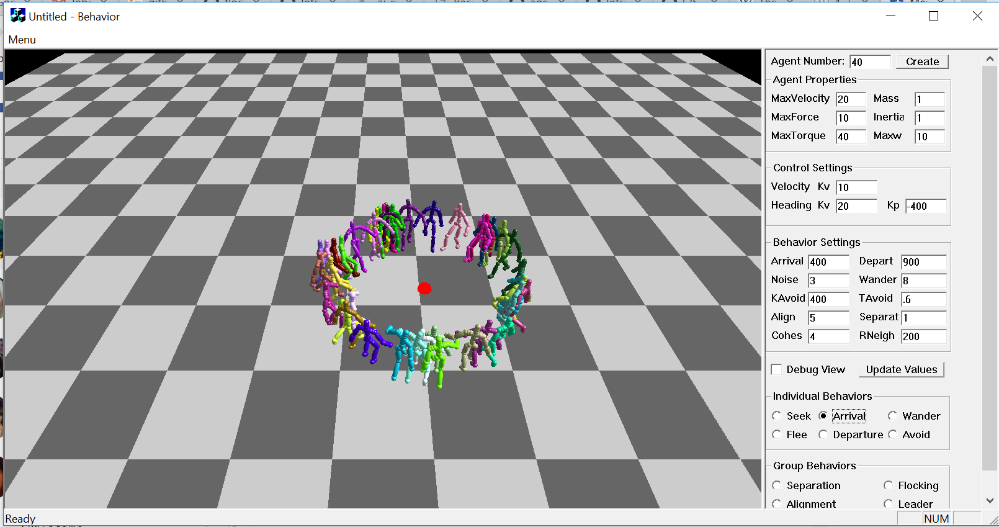
* Departure - implemented - from goal flee at max velocity slow to 0 at departure radisu The departure radius is noticably further away than the arrival radius.  I have a different picture 
* Wander - sort of implemented - chose a random angle and go that way, haven't figured out the Knoise
* Obstacle Avoidance - sort of implemented - will veer away from objects, was this also supposed to seek the goal?
Found some help on this topic from
https://gamedevelopment.tutsplus.com/tutorials/understanding-steering-behaviors-collision-avoidance--gamedev-7777

**(c) - 20 points**: Implement the functions for the following group behaviors: 
* Seperation
* Cohesion 
* Alignment 
* Flocking  I have a picture of flocking 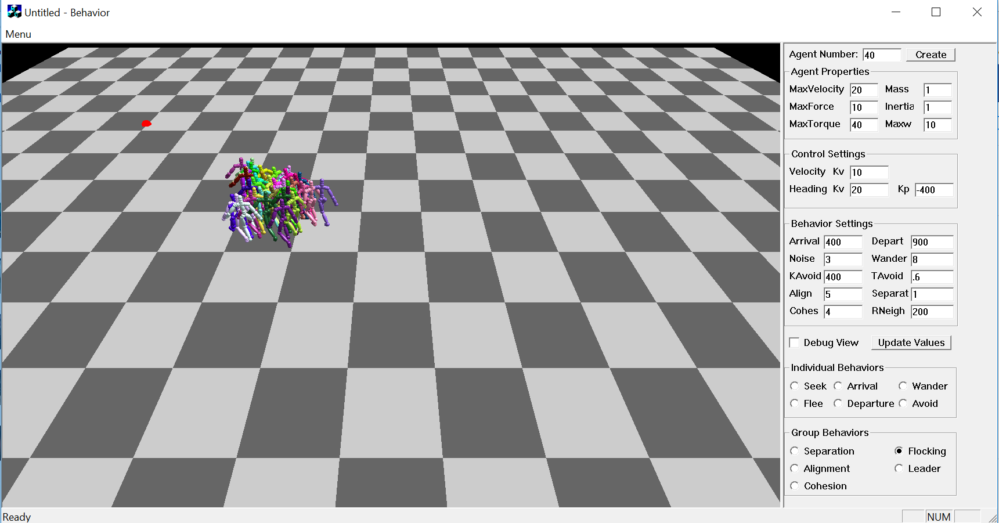
* Leader Following  I also have a picture of leader following 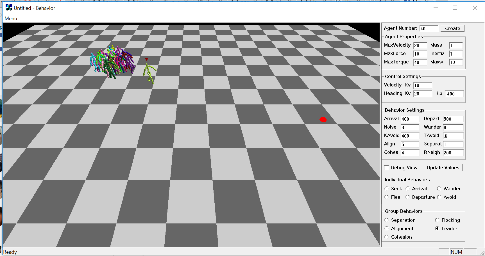
There is code for Seperation, Cohesion, Alignment, Flocking and Leader Following.  The code is based on the descriptions written in webcourses.
# Part 2 - Simulating a simple pedestrian flow

The goal of this part of the assigment is to simulate the pedestrain flow for various configurations. Pedestrian traffic simulation is an important, sometimes required, stage for certain construction projects such as shopping centers, airports, railway stations, or stadiums. hese analyses can be used by architects in the design stage, by facilities owners contemplating changes, by city planners to evaluate rush hours, or even by civil authorities to simulate evacuations or other emergencies. 


**(a) - 0 points**: Follow the Anylogic example for the [Subway Entrance example](https://help.anylogic.com/index.jsp?topic=/com.xj.anylogic.help/html/_PL/tutorial/Subway_Entrance.html). Create the appropriate [boundaries and walls](https://help.anylogic.com/index.jsp?topic=/com.xj.anylogic.help/html/markup/Wall.html), and the display ther pedestrian density map, [statistics](https://help.anylogic.com/index.jsp?nav=/4_1_5), [2D and 3D animations](https://help.anylogic.com/index.jsp?topic=/com.xj.anylogic.help/html/_PL/reference/Animation.html).


I did this and I created a 3D version.  I did not think all the pedestrians should look alike so I used CreateRandom to make a number of different subway riders.  More to the point for this homework, my different pedestrians have different movement rates so the heatmap changes a bit based on the flow of traffic.  This might have more of an effect in a model with less open space where slow pedestrians might block the way of faster pedestrians.
My 2D image looks very similar to the one above 
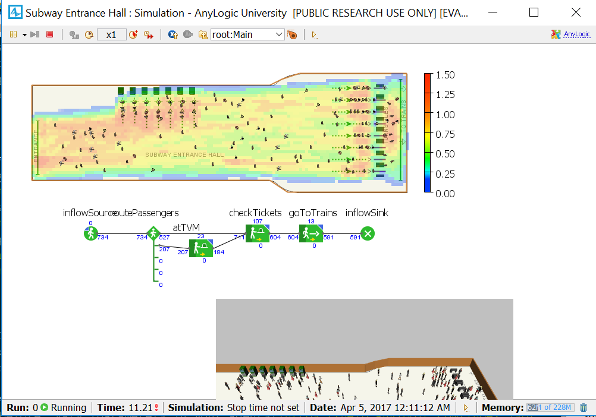

In the 3D image you can see the variety of pedestrians.
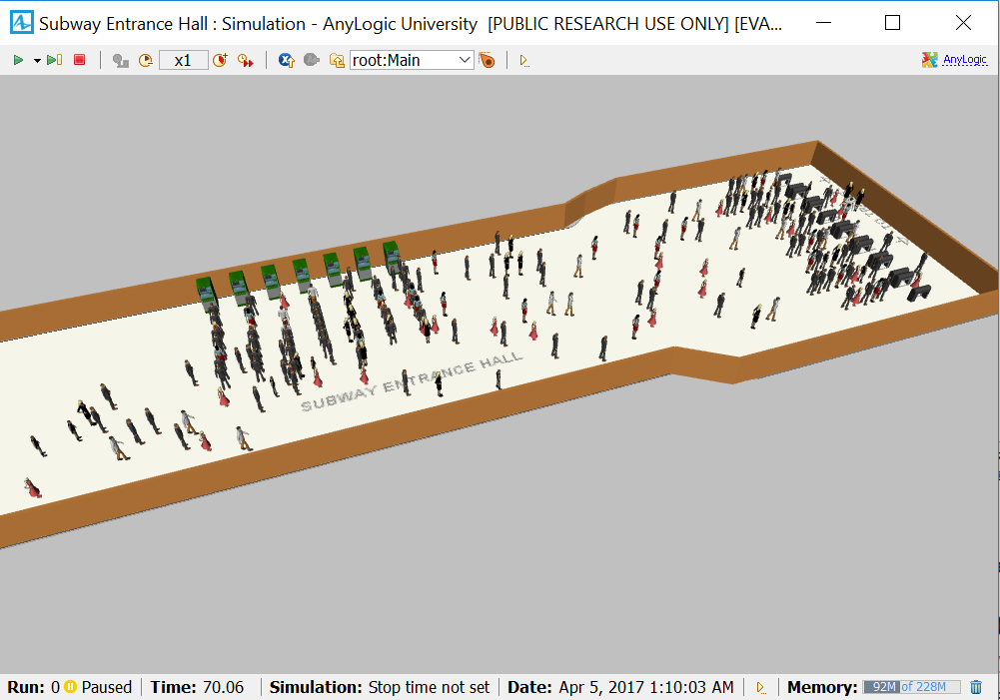

**(b) - 20 points**: Create a maze. Generate the pdm, stats, and animations like before. Vary [parameters in your agents](https://help.anylogic.com/index.jsp?topic=/com.xj.anylogic.help/html/_PL/reference/Attributes.html) to give them different behaviors and show the pedistrians change how they navigate the maze.
I started with a simple maze and created the pdm.  Not sure what stats to capture.  I need to add pictures here.

Initially all the pedestrians took one of two routes to the maze exit.  I added points in the dead ends and set those as destinations for a percentage of the population.  I also partially blocked one portion of the maze to see the change in the pdm.  I added a slider to change the rate at which pedestrians enter the maze.  

AnyLogic asked me to upgrade to AnyLogic 8 which had a new Space Markup Object - Ped Flow Statistics.  I created two of these and connected them to a chart to get the traffic flow through the left and right sides of the maze.   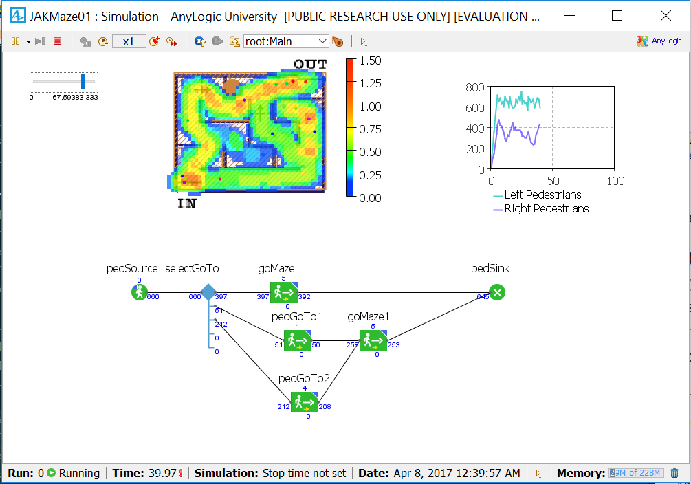


I added a 3D model to the simulation.  I am not showing the outer wall because it was made as a rectangular wall so the 3D version looks like a brick.  However, I am showing the interior walls. In addition I took the obstacle from adding the round wall and had it display as a tree in the 3D version.  I made a trash barrel in one dead end and a monitor in the other so the wandering pedestrians might have some reason to go there.  These are in the 2D model, but really show up in the 3D version.  See the screenshot showing the monitor with a blue agent headed towards it
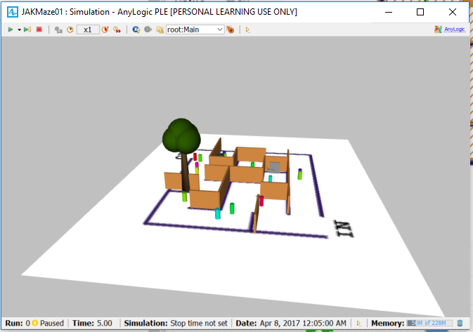
Then look at the other side to see the trash barrel.
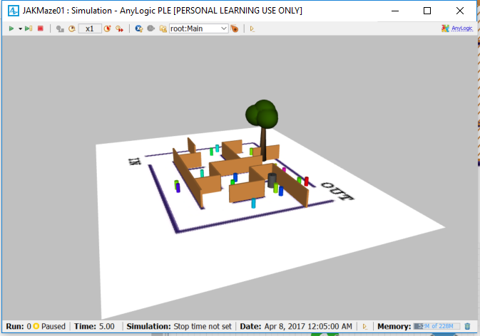
Finally, we can compare the heatmap of pedestrian locations between Maze2 which includes sending agents to these two dead end with the same heatmap on Maze1 where the pedestrians are not directed to the deadends.
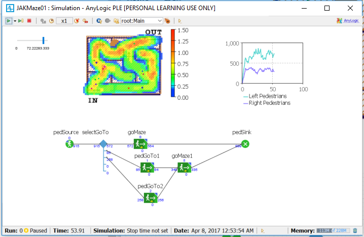
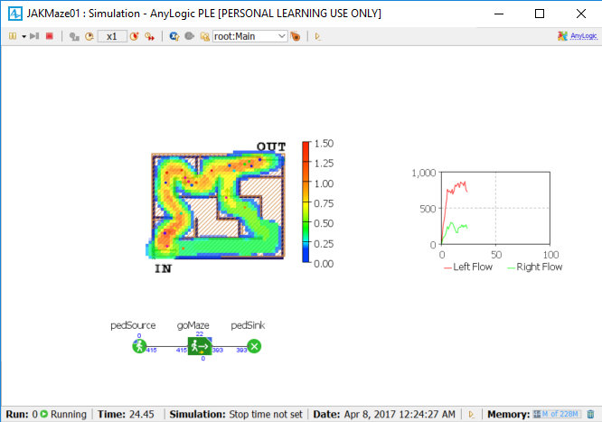

**(c) - 30 points**: Model and analyze a building (or floor/outdoor space/stadium) on campus. (There is help on piazza how to find rough building plans - we expect something plausible). Create a senario: evacuation, daily office routine, special event, normal egress.... etc., and model and design your own experiment to determine if the building design suits the needs of its users. Start with photographs of your site, describe your site, describe your senario and hypothesis. Then use an agent-based pedistrian simulation to visualize your experiment's results.

I am working on the student union.  I may not get all the details as this is a complex space.  I would like to be able to model movement from the first floor to the second floor.  I also want to be able to model several different kinds of activities because many activities occur in this building.  

The new release of AnyLogic said there was a sort of evacuation option.  I want to read more about that and try it.  I currently have folks coming in and going out different doors, waiting for food at Subway and getting print jobs.  There are clearly many different activities in the student union and there are already some areas with pedestrian traffic challenges.

I have stairs and elevator working with people going to the second and the third floors.  Not all of my wait times are realistic, but I can show the challenge of many people trying to exit the ballroom.
I need to work some statistics just in case I run out of time.  I'm enjoying building the model, but the statistics are needed for the assignment. Oh neat in my huge student union model, I can create a view just for statistics.  That makes it easier to find and read the chart.  I intend to add a second, but for now I have one that shows traffic flow through a line on each floor.  The first floor line shows the pedestrians cutting through the MASS store to get to another point.  The second floor shows the congested area between the elevator and the stairs.  The third floor just shows the number of people who went to the third floor.
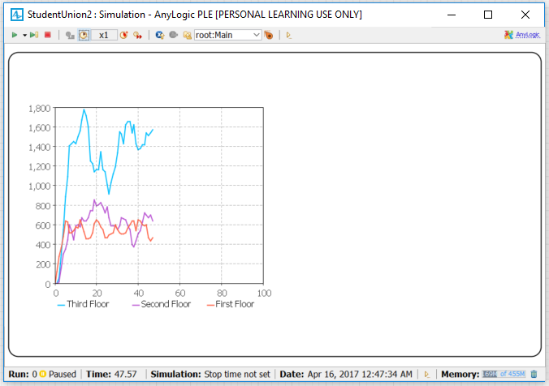
The initial heatmap shows
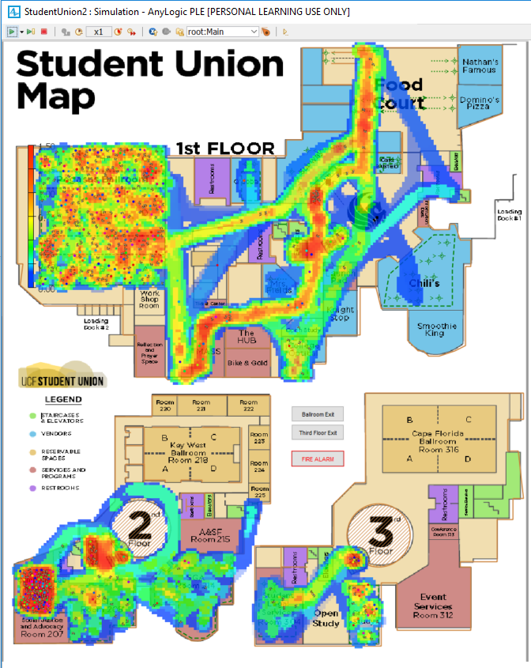
Then look at what happens when I end the event in the ballroom.
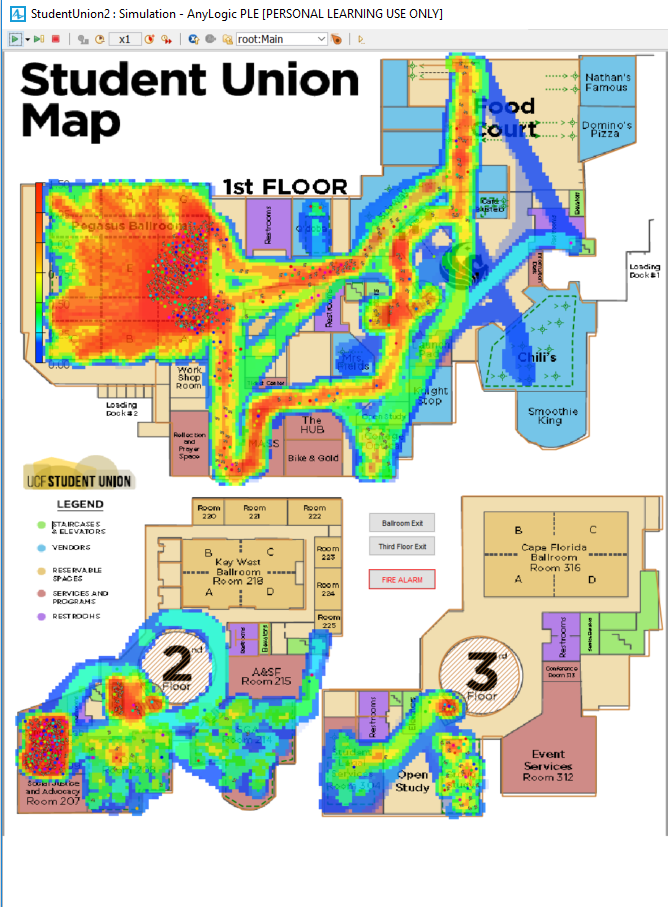
A little while later
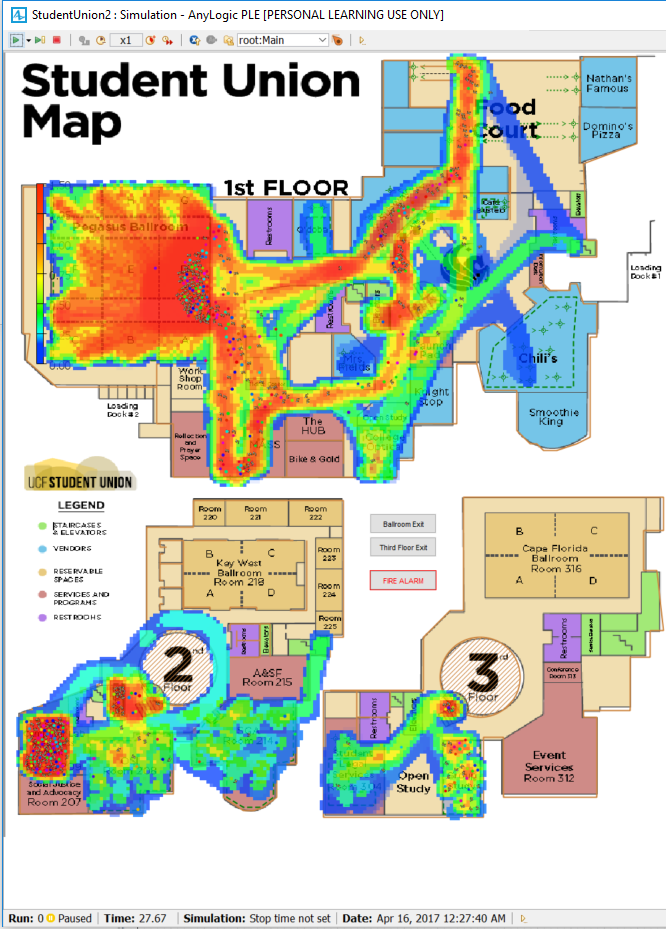
Then the fire alarm is pressed and people stop comming into the building.  Everyone must exit by the stairwells not the elevator.
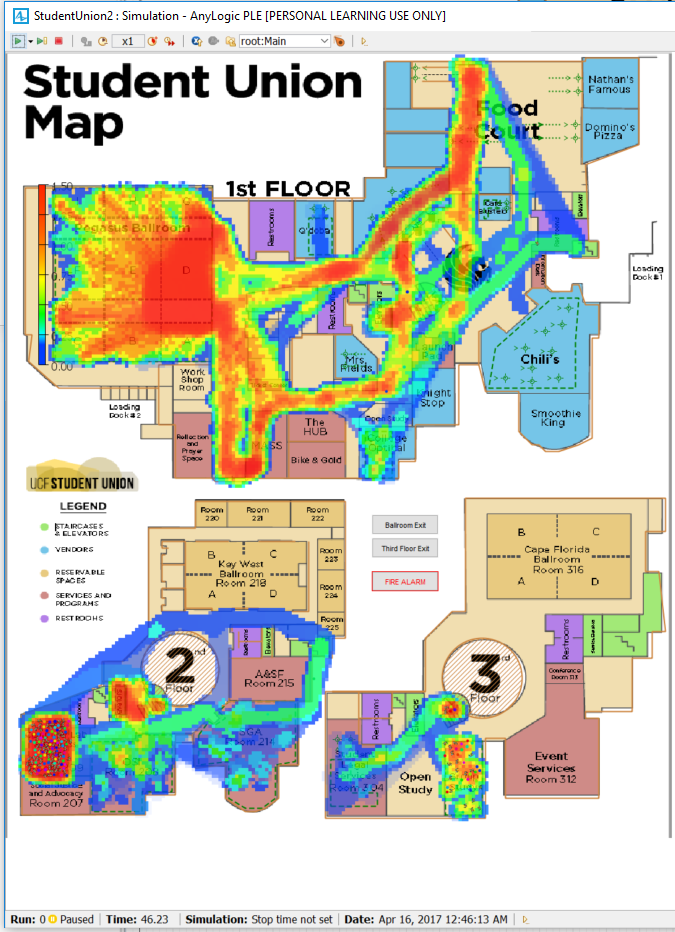
Okay I implmented the choice of 5 different fast food options. I also added a waiting area in the food court for individuals eating there.  I made some variations in the different queues for the different fast food counters.  So I am adding a histogram to look at wait times from when a person enters the queue to when they exit.  The image below shows the first two queues whih both have uniform wait times, but the second queue has a longer recovery period between services.
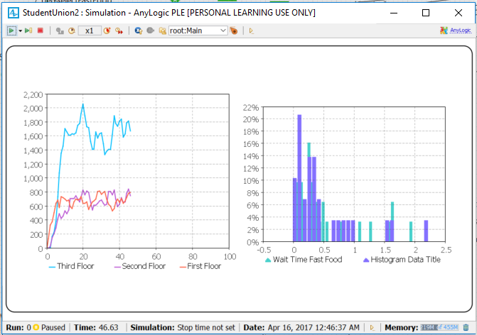
The bars are overlapping and it does not look like this will scale well to all five fast food options.  Should I try to add all five or shoul I play with chart options first? I don't see an obvious way to change the bins, but I did ad some labels and the queue for the fifth fast food counter which has a Poisson distribution for service time rather than a uniform distribution.  I am not certain the difference is obvious.
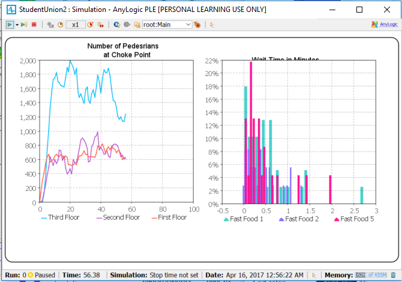
The difference in the pedestrian traffic resulting from the fast food counters is obvious in the new heatmap.
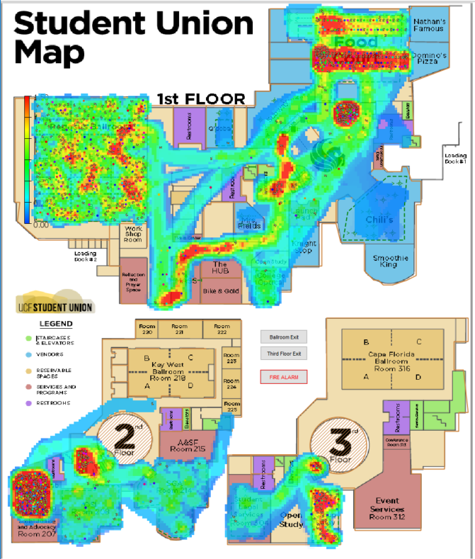
n the 3D view it is easy to see the fast food queues forming.
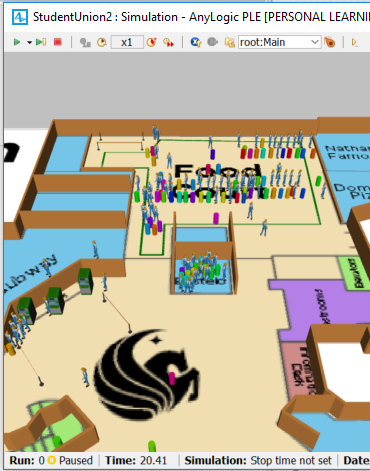
The corresponding wait statistics at this point show
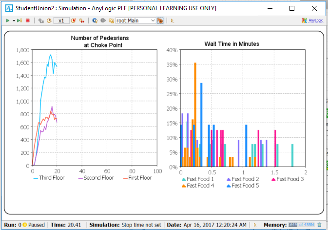
When setting up the second and third floor, I created a new ground and set all the objects on that floor to use the new ground.  This eliminated people running outside the walls when the fire alarm was pressed.  The pedestrian traffic heatmap is currently associated with the first floor so the signature that shows in the stairwell is pedestrians coming up from the first floor.
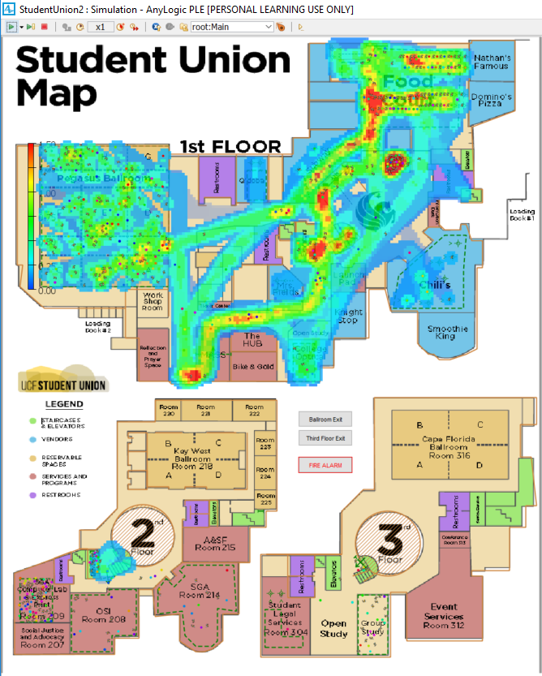
Immediately after the firealarm is pressed this changes to
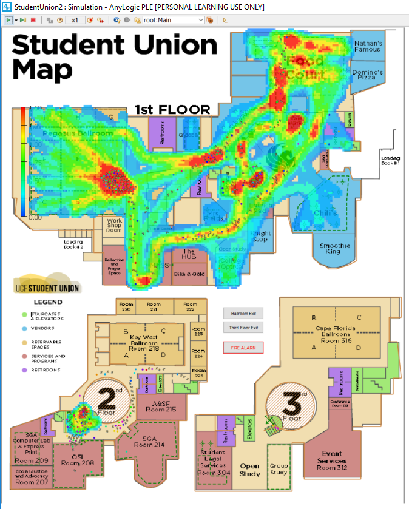
Finally all the pedestrians clear the buidling using only the stairwells because the elevators are disabled when the fire alarm is pressed.
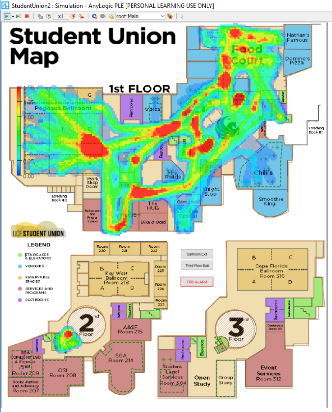


